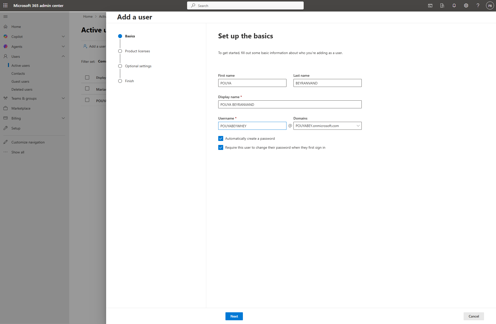
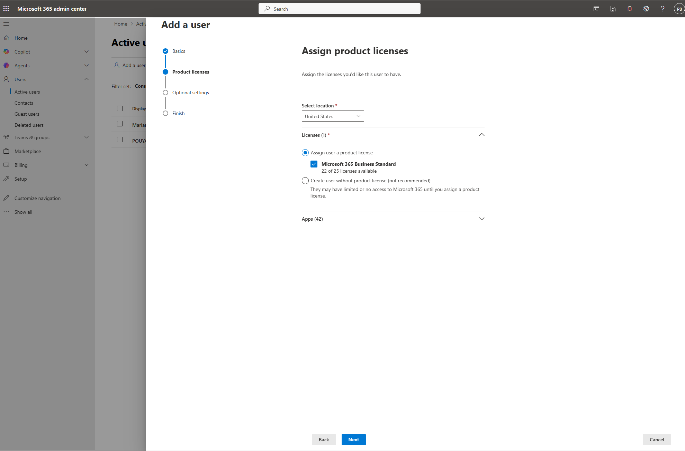
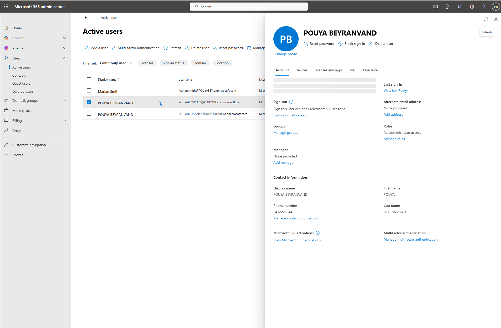

# Ticket 01: New User Setup in Microsoft 365

## User Report

A manager requested a new Microsoft 365 account for a new employee who needed access to Microsoft 365 services such as Outlook, Teams, OneDrive, and SharePoint.

## Lab Environment

- Microsoft 365 Admin Center
- Microsoft 365 test tenant
- Microsoft 365 user account
- License assignment
- Standard user role

## Issue Summary

A new user account needed to be created and prepared for first sign-in.

## Admin Steps

1. Opened the Microsoft 365 Admin Center.
2. Navigated to **Users → Active users**.
3. Selected **Add a user**.
4. Created a new test user account.
5. Assigned the appropriate Microsoft 365 license.
6. Required the user to change their password at first sign-in.
7. Verified the account appeared under Active users.

## Resolution

The Microsoft 365 user account was created successfully, assigned a license, and prepared for first sign-in.

## Skills Demonstrated

- Microsoft 365 user provisioning
- License assignment
- New employee onboarding support
- Microsoft 365 Admin Center navigation
- Help desk documentation

## Screenshots

