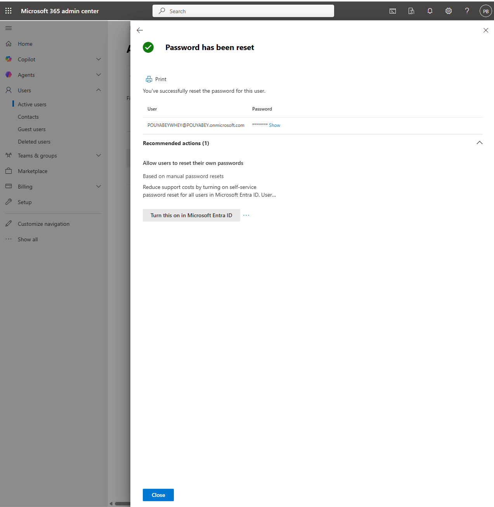
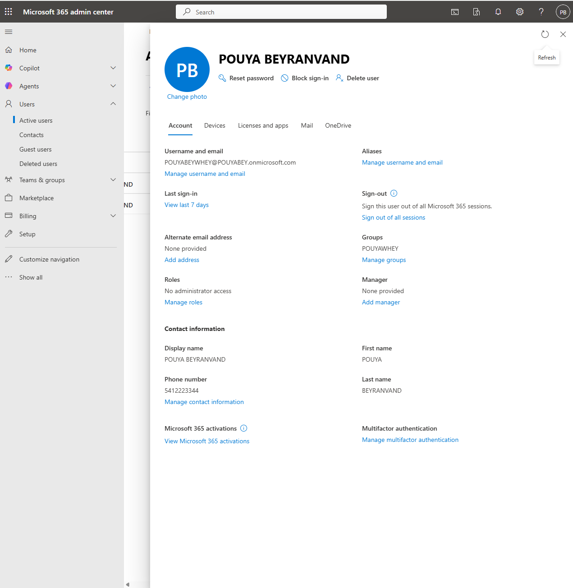

# Ticket 02: Password Reset and Sign-in Support

## User Report

The user reported that they could not sign in to Microsoft 365.

## Lab Environment

- Microsoft 365 Admin Center
- Microsoft 365 user account
- Password reset workflow
- Sign-in status review

## Initial Checks

- Verified that the user account existed.
- Checked the user's sign-in status.
- Confirmed that the account was not blocked.
- Prepared a temporary password reset.

## Admin Steps

1. Opened the Microsoft 365 Admin Center.
2. Navigated to **Users → Active users**.
3. Selected the affected user.
4. Reset the user's password.
5. Required the user to change the password at next sign-in.
6. Verified the user's sign-in status.
7. Documented the resolution.

## Resolution

The user's password was reset successfully, and the user was instructed to sign in using the temporary password and create a new password.

## Skills Demonstrated

- Password reset
- Sign-in troubleshooting
- User account support
- Microsoft 365 Admin Center navigation
- End-user support documentation

## Screenshots

