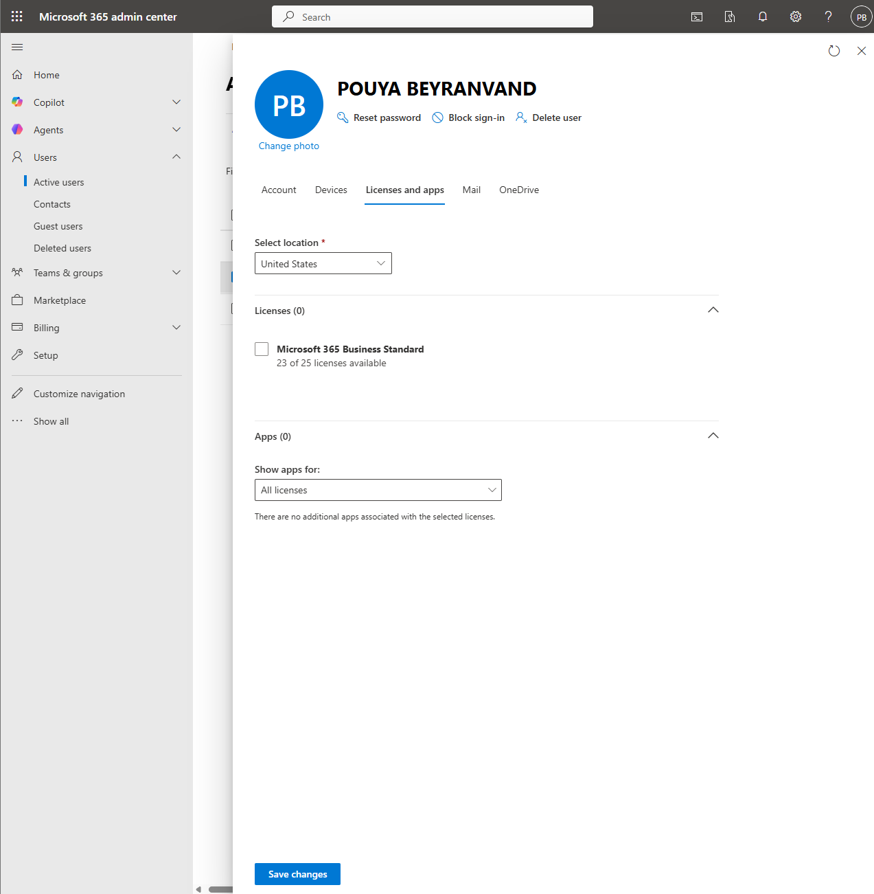
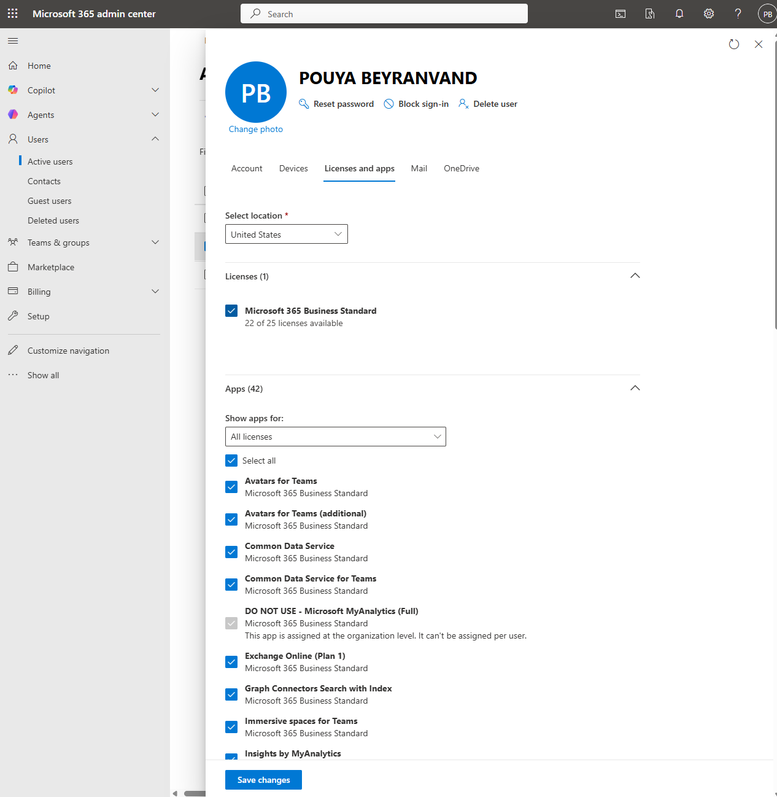
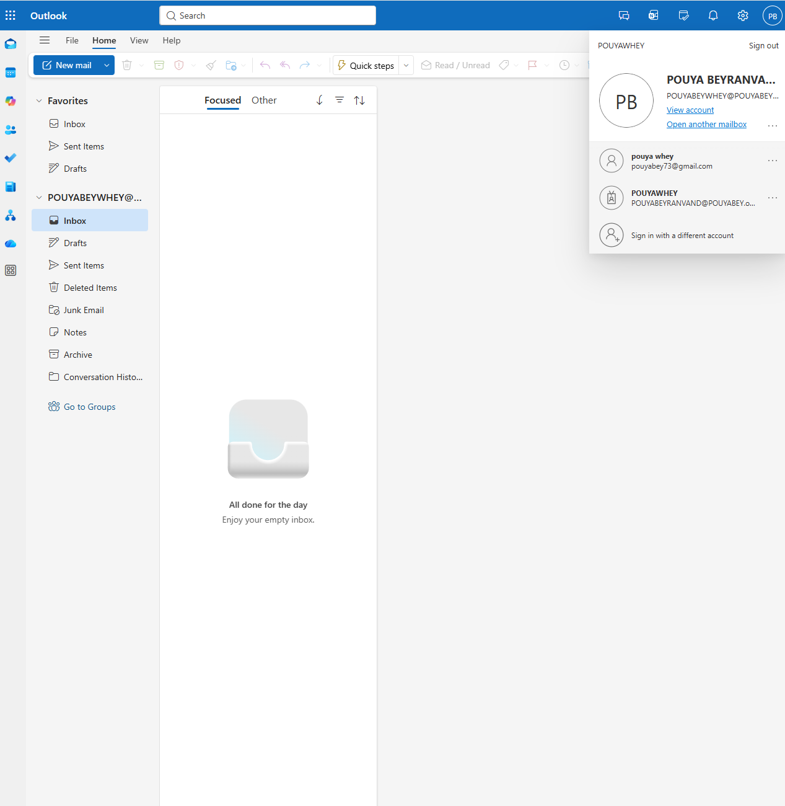

# Ticket 03: License Assignment Issue

## User Report

The user reported that they could not access Microsoft 365 apps such as Outlook and Teams.

## Lab Environment

- Microsoft 365 Admin Center
- Microsoft 365 licensing
- Outlook on the web
- Microsoft 365 test user account

## Initial Checks

- Verified that the user account was active.
- Reviewed the user's assigned licenses.
- Confirmed that the user did not have a Microsoft 365 license assigned.

## Admin Steps

1. Opened the Microsoft 365 Admin Center.
2. Navigated to **Users → Active users**.
3. Selected the affected user.
4. Opened the **Licenses and apps** section.
5. Confirmed that no license was assigned.
6. Assigned the appropriate Microsoft 365 license.
7. Verified that required apps such as Outlook, Teams, OneDrive, and SharePoint were enabled.
8. Signed in to Outlook on the web to validate mailbox access.

## Resolution

The user was assigned the required Microsoft 365 license, and Outlook access was successfully validated from the end-user perspective.

## Skills Demonstrated

- Microsoft 365 license troubleshooting
- App access support
- Outlook mailbox validation
- Microsoft 365 Admin Center navigation
- End-user access verification

## Screenshots

