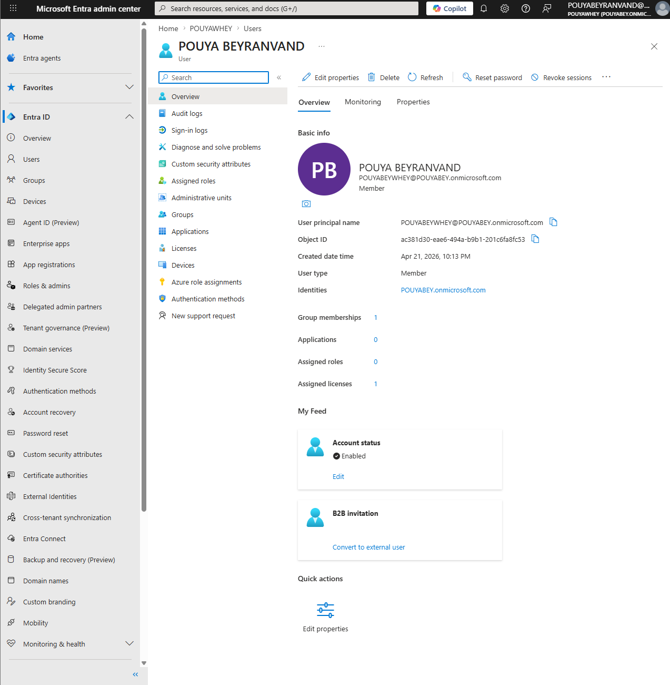
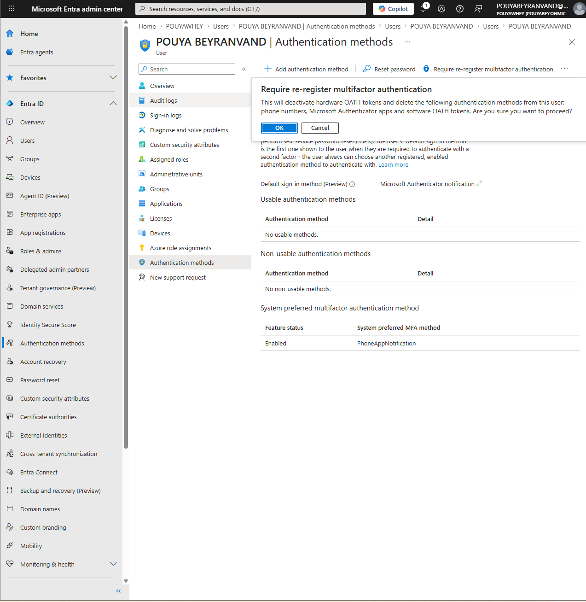
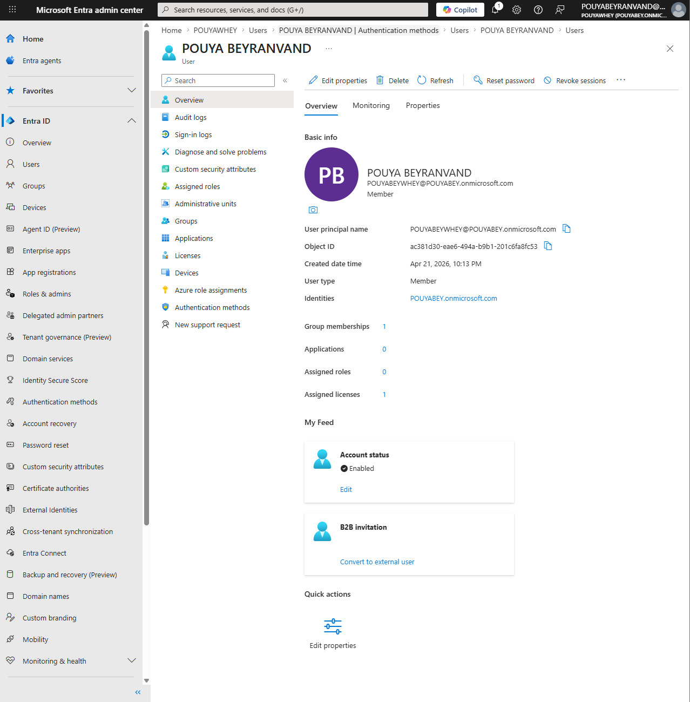

# Ticket 04: MFA / Authentication Methods Support

## User Report

The user reported that they could not complete MFA because their authentication method was no longer available.

## Lab Environment

- Microsoft Entra Admin Center
- Microsoft 365 user account
- Authentication methods
- MFA registration support

## Initial Checks

- Verified that the user account was active.
- Reviewed the user's authentication methods.
- Confirmed that the user needed MFA registration support.

## Admin Steps

1. Opened the Microsoft Entra Admin Center.
2. Navigated to **Users**.
3. Selected the affected user account.
4. Opened **Authentication methods**.
5. Reviewed the user's current authentication methods.
6. Removed outdated authentication information if needed.
7. Required the user to re-register MFA.
8. Documented the user-facing resolution.

## Resolution

The user's authentication methods were reviewed and MFA registration was reset so the user could register a new authentication method.

## Skills Demonstrated

- MFA support
- Authentication methods review
- Microsoft Entra Admin Center navigation
- Secure account recovery
- Identity and access support

## Screenshots

